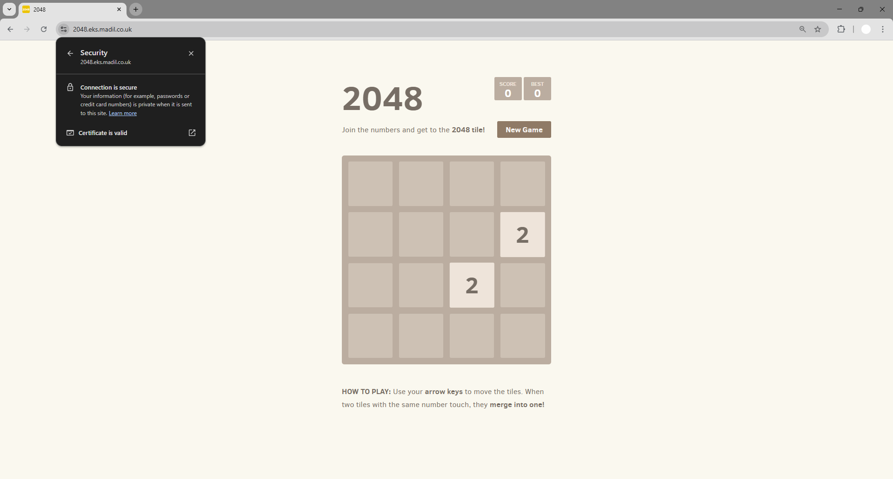
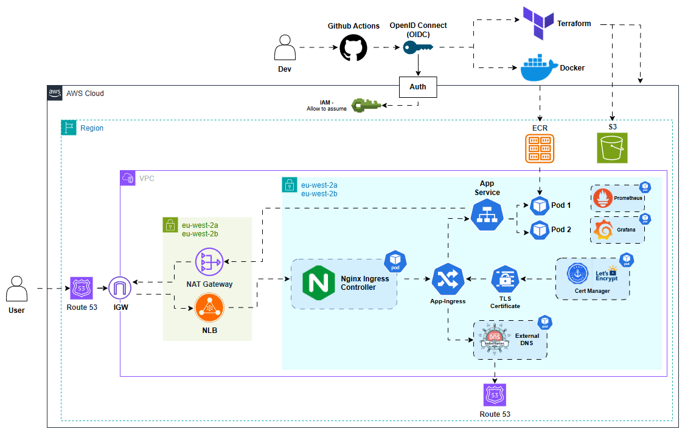

# 🚀 EKS 2048 – Production-Ready GitOps Deployment on Kubernetes

This project deploys a **production-ready Kubernetes platform** on **Amazon EKS** (Elastic Kubernetes Service) with infrastructure managed through **Terraform** and workloads deployed via **Helm**. The solution provisions a secure, scalable, and observable environment with an **NGINX Ingress Controller** for external routing, **cert-manager** for automated TLS certificates, **External-DNS** for Route53 DNS management, and **ArgoCD** for **GitOps-based** continuous delivery.

**Prometheus** and **Grafana** provide comprehensive **observability** and **monitoring** across the cluster, enabling real-time insight into **system health**, **resource usage**, and **application performance**. This setup ensures infrastructure and application deployments are consistent, secure, and fully automated, delivering a **resilient** Kubernetes environment accessible through a custom domain over **HTTPS**.

As a demonstration workload, the classic **2048 web game** is deployed onto the EKS cluster via **ArgoCD**, showcasing end-to-end automation from infrastructure provisioning to application delivery.

<p align="center">
  
</p>

## 🏗️ Architecture Diagram:

<p align="center">
  
</p>

## 📁 Project Structure
```
└── EKS-GITOPS-2048
    ├── pre-commit-config.yaml
    ├── app/
    ├── terraform/
    │    ├── backend.tf
    │    ├── main.tf
    │    ├── provider.tf
    │    ├── variables.tf
    │    └── modules/
    │        ├── EKS/
    │        ├── VPC/
    │        ├── nodegroup/
    │        ├── pod-identity/
    │        └── helm/
    └── .github/workflows/
           ├── tf-apply-destroy.yaml
           ├── tf-lint-scan-plan.yaml
           └── docker-build-push.yaml
```

## 🏗️ Architecture
#### Key Components:

- **Amazon EKS**: Manages the Kubernetes control plane for secure, scalable container orchestration.
- **EKS Managed Node Groups**: Run worker nodes in private subnets with automatic scaling and updates.
- **EKS Pod Identity**: Provides fine-grained IAM access to pods without node-level credentials, enabling secure AWS API access for services like cert-manager and External-DNS.
- **Terraform**: Defines and provisions all AWS and Kubernetes infrastructure through infrastructure-as-code.
- **Helm**: Deploys core Kubernetes components including NGINX Ingress, cert-manager, External-DNS, ArgoCD, and Prometheus/Grafana.
- **ArgoCD**: Enables GitOps-based continuous delivery, syncing application manifests from Git repositories.
- **NGINX Ingress Controller**: Routes external traffic into the cluster and handles HTTPS termination.
- **cert-manager**: Automates TLS certificate issuance and renewal via Let’s Encrypt and Route53 DNS validation.
- **External-DNS**: Automatically manages Route 53 DNS records for Kubernetes services and ingress resources.
- **Prometheus & Grafana**: Provide real-time observability, metrics, and dashboards for monitoring cluster health, resource usage, and application performance.
- **Security & Compliance**: Uses IAM least privilege, private networking, and Terraform scanning tools (TFLint, Checkov) for secure, compliant deployments.