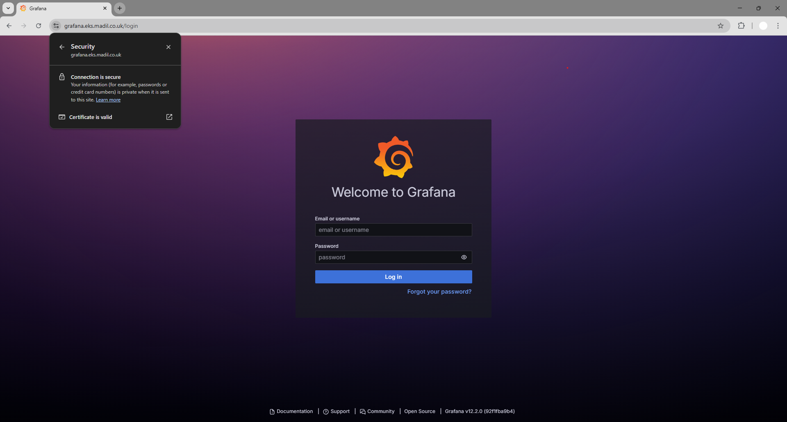

# 🚀 EKS 2048 – Production-Ready GitOps Deployment on Kubernetes

This project deploys a **production-ready Kubernetes platform** on **Amazon EKS** (Elastic Kubernetes Service) with infrastructure managed through **Terraform** and workloads deployed via **Helm**. The solution provisions a secure, scalable, and observable environment with an **NGINX Ingress Controller** for external routing, **cert-manager** for automated TLS certificates, **External-DNS** for Route53 DNS management, and **ArgoCD** for **GitOps-based** continuous delivery.

**Prometheus** and **Grafana** provide comprehensive **observability** and **monitoring** across the cluster, enabling real-time insight into **system health**, **resource usage**, and **application performance**. This setup ensures infrastructure and application deployments are consistent, secure, and fully automated, delivering a **resilient** Kubernetes environment accessible through a custom domain over **HTTPS**.

As a demonstration workload, the classic **2048 web game** is deployed onto the EKS cluster via **ArgoCD**, showcasing end-to-end automation from infrastructure provisioning to application delivery.

<p align="center">
  
</p>

## 🏗️ Architecture Diagram:

<p align="center">
  
</p>

## 📁 Project Structure
```
└── EKS-GITOPS-2048
    ├── pre-commit-config.yaml
    ├── app/
    ├── terraform/
    │    ├── backend.tf
    │    ├── main.tf
    │    ├── provider.tf
    │    ├── variables.tf
    │    └── modules/
    │        ├── EKS/
    │        ├── VPC/
    │        ├── nodegroup/
    │        ├── pod-identity/
    │        └── helm/
    └── .github/workflows/
           ├── tf-apply-destroy.yaml
           ├── tf-lint-scan-plan.yaml
           └── docker-build-push.yaml
```

## 🏗️ Architecture
#### Key Components:

- **Amazon EKS**: Manages the Kubernetes control plane for secure, scalable container orchestration.
- **EKS Managed Node Groups**: Run worker nodes in private subnets with automatic scaling and updates.
- **EKS Pod Identity**: Provides fine-grained IAM access to pods without node-level credentials, enabling secure AWS API access for services like cert-manager and External-DNS.
- **Terraform**: Defines and provisions all AWS and Kubernetes infrastructure through infrastructure-as-code.
- **Helm**: Deploys core Kubernetes components including NGINX Ingress, cert-manager, External-DNS, ArgoCD, and Prometheus/Grafana.
- **ArgoCD**: Enables GitOps-based continuous delivery, syncing application manifests from Git repositories.
- **NGINX Ingress Controller**: Routes external traffic into the cluster and handles HTTPS termination.
- **cert-manager**: Automates TLS certificate issuance and renewal via Let’s Encrypt and Route53 DNS validation.
- **External-DNS**: Automatically manages Route 53 DNS records for Kubernetes services and ingress resources.
- **Prometheus & Grafana**: Provide real-time observability, metrics, and dashboards for monitoring cluster health, resource usage, and application performance.
- **Security & Compliance**: Uses IAM least privilege, private networking, and Terraform scanning tools (TFLint, Checkov) for secure, compliant deployments.

#
## ⚙️ How It Works
### 🌐 Terraform Infrastructure Provisioning
All infrastructure is defined in the `terraform/` directory with a modular setup (VPC, EKS, helm, etc). This modular approach makes the code easy to extend, test, and maintain.
- Provisions a **VPC** with public and private subnets, Internet/NAT gateways, and routing tables.
- Creates the **EKS control plane** with managed node groups for scalable Kubernetes compute.
- Configures **IAM roles** for cluster operations, node groups, and Pod Identity access for AWS services.
- Deploys essential **Helm charts**: NGINX Ingress Controller, cert-manager, External-DNS, ArgoCD, and Prometheus/Grafana.
- Integrates **Route53** for DNS management and automated certificate validation via cert-manager.

```yaml
resource "aws_eks_cluster" "main" {
  name     = "eks-2048"
  version  = "1.34"
  role_arn = aws_iam_role.cluster.arn

  vpc_config {
    subnet_ids              = var.public_subnets
    endpoint_public_access  = true
    endpoint_private_access = false
    public_access_cidrs     = ["0.0.0.0/0"]
  }
}
```
> 🏗️ One `terraform apply` provisions the entire platform - networking, compute, IAM, observability, and GitOps in a fully automated way.

#
### 🐙 Application Deployment with ArgoCD
ArgoCD is a GitOps-based continuous delivery tool that automatically syncs Kubernetes manifests from a Git repository to the cluster. It ensures the running state always matches what’s defined in Git, enabling version-controlled, automated, and reversible deployments.

```yaml
  source:
    repoURL: 'https://github.com/madil002/eks-gitops-2048.git'
    targetRevision: main
    path: manifests
```
This defines the source of truth for the deployment - the Git repository and path containing the Kubernetes manifests to be synced to the cluster. 
- Changes committed to this repo automatically trigger an update in the EKS cluster (no manual `kubectl apply` required).
- The `targetRevision` (branch) ensures ArgoCD always deploys the desired version of your manifests.

```yaml
    automated:
      prune: true
      selfHeal: true
```
This enables automated synchronization of Git changes and self-healing, ensuring the cluster continuously aligns with the desired state.
- **Prune**: removes outdated Kubernetes objects no longer defined in Git.
- **SelfHeal**: automatically corrects any configuration drift between the cluster and repository.

#
### 🔐 Secure Service Integration via Pod Identity
**EKS Pod Identity** allows pods to securely assume AWS IAM roles **without using node credentials** or **static access keys**. This provides fine-grained, pod-level access control for AWS services directly from within Kubernetes workloads.
```yaml
resource "aws_eks_pod_identity_association" "cert_manager" {
  cluster_name    = var.cluster_name
  namespace       = "cert-manager"
  service_account = "cert-manager"
  role_arn        = aws_iam_role.cert_manager.arn
}
```
> This links the cert-manager **service account** to an **IAM role**, allowing it to access Route53 for DNS validation when issuing TLS certificates.

By assigning IAM roles at the pod level instead of the node level, workloads only access the AWS resources they’re explicitly permitted to use. This prevents compromised pods from escalating privileges or using node credentials, reducing the attack surface and enforcing least-privilege access across the cluster.

#
### 🔁 Ingress, Certificates & DNS Automation
Incoming traffic to the cluster is handled by the **NGINX Ingress Controller**, which manages routing, load balancing, and HTTPS termination for exposed services. Alongside it, **cert-manager** and **External-DNS** automate certificate management and DNS updates by continuously watching specific fields within Kubernetes resources and reacting accordingly.
```yaml
kind: Ingress
  annotations:
    cert-manager.io/cluster-issuer: "issuer"
    external-dns.alpha.kubernetes.io/hostname: "2048.eks.madil.co.uk"
spec:
  tls:
    - hosts:
        - 2048.eks.madil.co.uk
      secretName: game-2048-tls
  rules:
    - host: 2048.eks.madil.co.uk
      backend:
      ...
        service:
          name: game-2048
          port:
            number: 80
```
- The **Ingress Controller** reads the ingress resource and routes incoming requests for `2048.lab.madil.co.uk` to the appropriate Kubernetes service (in this case, the 2048 game).
- **cert-manager** monitors the `tls` block and `cert-manager.io/cluster-issuer` annotation, automatically issuing and renewing TLS certificates via **Let’s Encrypt**.
- **External-DNS** detects the `hostname` annotation and creates or updates the corresponding DNS record in **Route53**, ensuring the domain always points to the ingress endpoint.

Together, these controllers create a **self-managing HTTPS workflow** - defining an ingress resource triggers DNS record creation, certificate issuance, and secure traffic routing automatically. This removes the need for manual DNS updates or certificate handling, ensuring applications are always reachable and secured with valid TLS certificates.

#
### 🔍 Terraform Plan, Security & Deployment
Before applying any changes, the Terraform workflows validate, scan, and manage infrastructure updates, ensuring safe, compliant deployments. The workflows are required to prevent unverified or incorrect plans from being applied, acting as a critical safety gate to the AWS environment.

**Plan & Security Scanning:**
- Runs `terraform init` and `terraform plan` to preview infrastructure changes without applying them.
- Executes **TFLint** to detect syntax errors, unused variables, and configuration issues.
- Uses **Checkov** to scan Terraform code for security misconfigurations (e.g., unencrypted storage, overly permissive IAM roles).
- Uploads SARIF reports to **GitHub’s Security** tab for visibility and auditing.

```yaml
- name: Run TFLint
  run: |
    tflint --init
    tflint --format sarif > tflint.sarif

- name: Run Checkov
  uses: bridgecrewio/checkov-action@v12
```

**Apply & Destroy:**
 - **Terraform apply** - Safely provisions or updates the complete AWS infrastructure stack, ensuring all resources are deployed consistently and securely. This step only runs after the plan has been validated.
 - **Terraform destroy** - Tears down environments when no longer needed, helping avoid unnecessary AWS costs in dev/test setups.

 <p align="center">
   
 </p>

  > 📌 Key Benefit: The workflow enforces that only validated plans reach production, reducing human error and preventing misconfigured or unsafe infrastructure from being deployed.

#
## 🖼️ Visual Reference
<p align="center">
  
</p>
<p align="center">
  
</p>
<p align="center">
  
</p>
<p align="center">
  
</p>
<p align="center">
  
</p>
